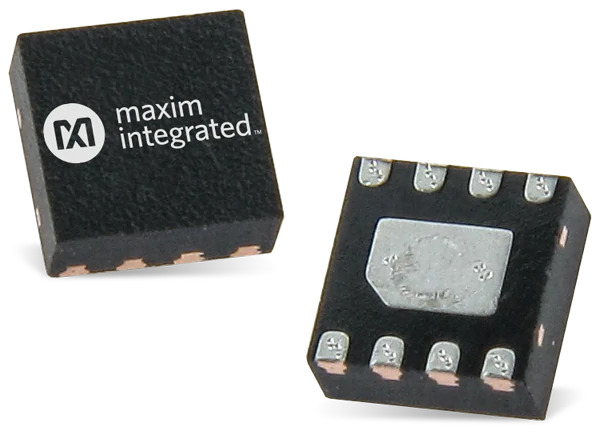

# Maxim Integrated MAX30205

Driver for Maxim Integrated [MAX30205](https://www.maximintegrated.com/en/products/interface/sensor-interface/MAX30205.html)

**Clinical local body temperature sensor ±0.1°C accurary**

  

## New Features

- Custom `TwoWire` interface can be passed.
- Auto Address deteted: Automatically detects sensors without any need to passing address
- Multi-sensor: Supports multiple sensor and can automatically find all of them.
